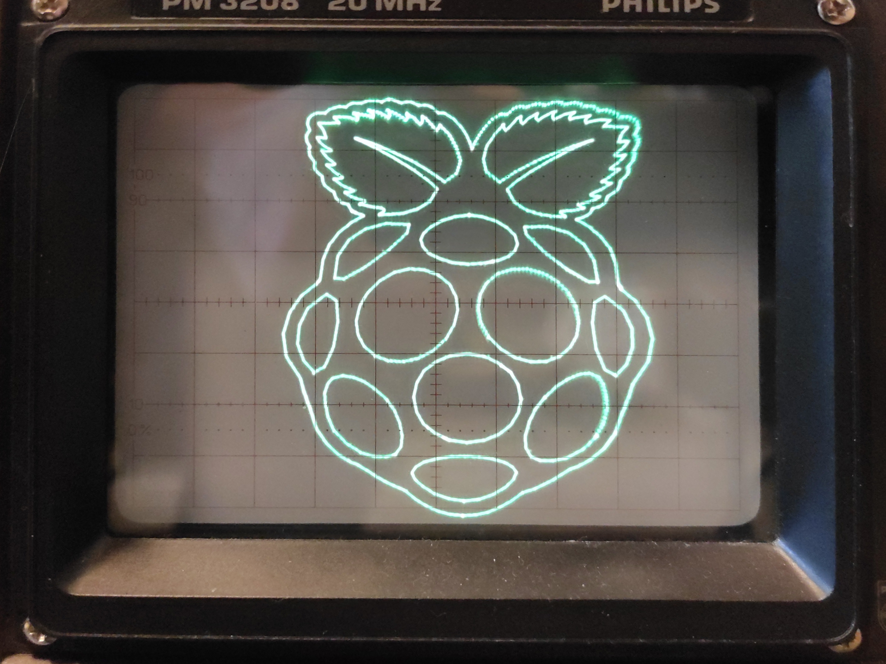
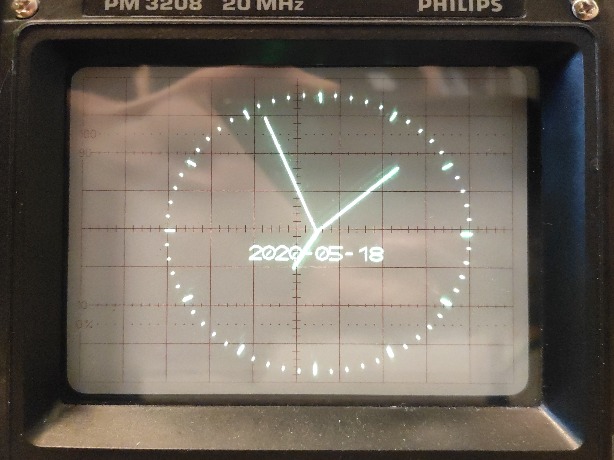
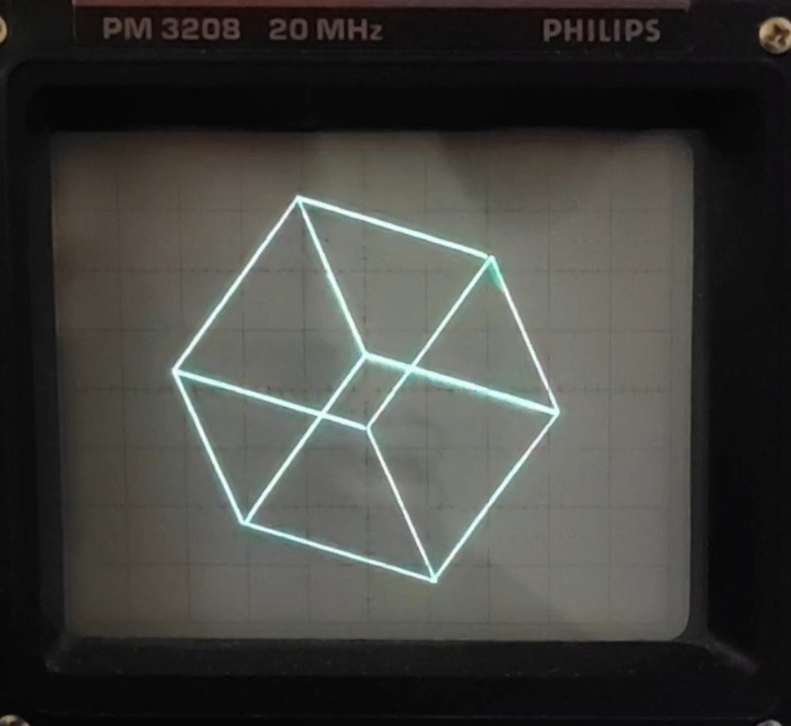

</img>
</img>
</img>

   

# vecdisp
vecdisp is a student project which attempts to recreate the look of old vector displays such as the one seen on the Vectrex videogame console. We use modern hardware (the Raspberry Pi 2) and a custom-made HAT with 12-bit DACs. Alongside that we wrote the 'libvecdisp' C library found in this repo. It can be used to compile binaries directly on the Rasberry Pi which can be launched from our basic menu (which can be started at boot as a systemd service).
Cross compiling should theoretically also be possible, but is not tested yet. 
To create binaries without having access to the hardware, the library also has a compile option to output the application to the screen, using the 'SDL2' library.

#### libvecdisp
`libvecdisp.h` is the belonging C API. Its features are:
* initialization, deinitialization and communication to the DAC
* a drawing buffer which stores X / Y coordinates of vectors, brightness and operational codes.
* a single function to output the entire buffer to the DAC.
* drawing functions to draw lines, shapes, characters, strings, etc. . These functions generate and store buffer elements.
* a XY Simulator to develop applications with `libvecdisp` without needing any hardware (it is based on SDL2).

Individual functions are further explained in 'libvecdisp.h' and the documentation below.

## Hardware
The library and project is using:
* Raspberry Pi 2 / Raspberry Pi Zero W
* Microchip MCP4822 12-bit DAC's
* analog oscilloscope in XY-mode

# Raspberry Pi installation / configuration
We are using `Raspbian`. It can be downloaded [here](https://www.raspberrypi.org/downloads/raspbian/). 

Once installed, login with username `pi` and password `raspberry`. Be aware that the default keyboard layout is **english**, so for example on german keyboards you actually need to type in `raspperrz` because the `y` and `z` keys are swapped. Then use `sudo raspi-config` to tweak the settings. ( The `-` key on german keyboards is `?` )

> Localisation Options => Set as preferred

> Update

> Network Options => connect to your network

> Interfacing Options > SPI => "disable"

> Interfacing Options > SSH => "enable"

> Overclock > "HIGH"

> Advanced Options >
>   Expand Filesystem
>   Overscan => "disable"
>   Memory Split => "256"
>   GL Driver => GL (Full KMS)

Also, some settings in `/boot/config.txt` should be changed.

    hdmi_force_hotplug=1

Some additional packages are needed:

    $ sudo apt install git libsdl2-dev libgles2-mesa-dev libwayland-egl1-mesa libwayland-egl-backend-dev libgbm-dev

## bcm2835.h
For SPI and GPIO access the `bcm2835.h` library is used. It can be downloaded [here](https://www.airspayce.com/mikem/bcm2835/). The newest version right now is `bcm2835-1.63.tar.gz`.

    $ wget "http://www.airspayce.com/mikem/bcm2835/bcm2835-1.63.tar.gz"
    $ tar zxvf bcm2835-1.xx.tar.gz
    $ cd bcm2835-1.xx
    $ ./configure
    $ make
    $ sudo make check
    $ sudo make install

## SDL2
This step is optional, since `libvecdisp` is currently not depending on KMS with SDL2 / OpenGL. However, it could be useful for future 3d applications which utilize the GPU for rendering, and then use the transform feedback loop to offscreen render the generated primitives on the oscilloscope. This possibility still needs to be tested.

To enable KMS support for SDL2, it needs to be compiled and built manually. The raspbian stretch repository version is not built with KMS support unfortunately.
The full guide to compiling can be read [here](https://github.com/midwan/amiberry/wiki/Compile-SDL2-from-source).

First some packages must be installed

    $ sudo apt update
    $ sudo apt dist-upgrade
    $ sudo apt install libfreetype6-dev libgl1-mesa-dev libgles2-mesa-dev libdrm-dev libgbm-dev libudev-dev libasound2-dev liblzma-dev libjpeg-dev libtiff-dev libwebp-dev git build-essential

Then do the following steps for SDL2:

    $ cd ~
    $ wget https://libsdl.org/release/SDL2-2.0.12.tar.gz 
    $ tar zxvf SDL2-2.0.12.tar.gz
    $ cd SDL2-2.0.12
    $ ./configure --enable-video-kmsdrm --disable-video-rpi && make -j$(nproc) && sudo make install

Then, SDL2_image:

    $ wget https://libsdl.org/projects/SDL_image/release/SDL2_image-2.0.5.tar.gz
    $ tar zxvf SDL2_image-2.0.5.tar.gz
    $ cd SDL2_image-2.0.5
    $ ./configure && make -j $(nproc) && sudo make install

And at last, SDL2_ttf:

    $ wget https://libsdl.org/projects/SDL_ttf/release/SDL2_ttf-2.0.15.tar.gz
    $ tar zxvf SDL2_ttf-2.0.15.tar.gz
    $ cd SDL2_ttf-2.0.15
    $ ./configure && make -j $(nproc) && sudo make install
    $ sudo ldconfig -v

These shared libraries are installed in `/usr/local/lib/`. To use these libraries at compile and runtime, you can either add the path to the `LD_LIBRARY_PATH`, or link with the option `-Wl,-rpath=/usr/local/lib`.
This hardcopies the path of the shared library to the compiled program, so this is the preferred solution if you don't want to change the behaviour of other programs which may want to use the default libraries.

# Set-up
Cloning and setting up the project requires the following steps:

    $ cd /opt
    $ git clone https://github.com/fpunktz/vecdisp
    $ chown -R pi:pi ./vecdisp
    $ cd ./vecdisp
    $ sudo cp ./service/vecdisp.service /etc/systemd/system/
    $ sudo systemctl enable vecdisp.service
    $ sudo systemctl start vecdisp.service

This enables the startup and menu screen at boot time. From there, every binary with the file extension `.bin` in `vecdisp/apps` is listed and can be executed. For testing, you can disable the service temporarily with

    $ sudo systemctl stop vecdisp.service

# Building
Building apps can be done in the base directory with make.
There are a couple of C macros which can be changed via make at compile time:

* DEBUG => `y` or `n`. Yes for gdb debugging, no for -O3 optimized code and no debugging.
* OUT_METHOD => `SIM`, `SPIDAC`. SIM for simulating the screen with SDL2, `SPIDAC` for DAC output which is connected to the pi.
* OUT_RES => recommended are these values: `1024`, `2048` and `4096`. Other values between these three are possible, but then not the entire range of the dac is used ( output values are scaled like this: >= 1024, >= 2048, >= 4096).

For example, building `test.c` can be done with this command:

    $ make DEBUG=n OUT_METHOD=SPIDAC OUT_RES=1024 test

To use the compiled binary from the menu, copy and rename the file to `./apps`:

    $ cp ./bin/test ./apps/test.bin

You can also add new binaries to the Makefile. This can be done by appending these lines to it:

    new_app: $(OBJDIR)/new_app.o $(OBJDIR)/fonts.o $(OBJDIR)/libvecdisp.o
	    $(LD_CMD)

Of course, if other dependencies are needed, these need to be added to the make target and compile / link command.

### License

Licensed under either of <a href="LICENSE-APACHE">Apache License, Version
2.0</a> or <a href="LICENSE-MIT">MIT license</a> at your option.

### Contribution

Unless you explicitly state otherwise, any contribution intentionally submitted
for inclusion in this crate by you, as defined in the Apache-2.0 license, shall
be dual licensed as above, without any additional terms or conditions.

